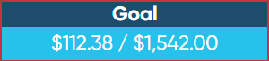
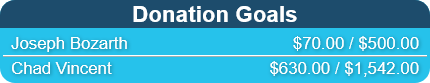
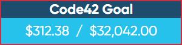
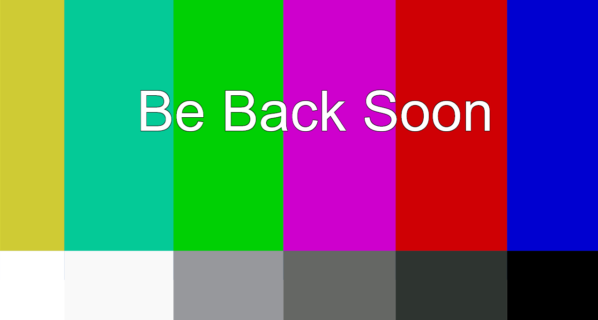

# 

# Overview
Extra Life Tracker is a collection of web pages that can be used as a web source in streaming software such as OBS to display your and your team's current Extra Life fund raising status and goal.

More in-depth information can be found on on [project page](http://josephbozarth.com/Extra-Life-Tracker/).

# Widgets

## [Countdown Timer](/countdown-timer)
## 
Displays the amount of time left in your event or the time left till your event starts if it is before the start of your event.

## [Last Donation](/last-donation)
## 
Displays the last donation for the specified participant.

## [Participant Goal](/participant-goal)
## 
Displays amount raised and goal for the specified participant.

## [Subteam Participants](/subteam-participants)
## 
Cycles through the fundraising amounts of a specified number of participants.

## [Team Goal](/team-goal)
## 
Displays amount raised and goal for the specified team.

## [Offline Screen](/offline-screen)
## 
Displays an offline message and optionally plays elevator music.

# Configuration
Each widget has a `[widget-name]-settings.js` file in its folder (e.x. `participant-goal-settings.js`), to set up the widget just update the values in there with the correct values you would like to use. There are full descriptions of the values in the settings files for each widget.

# Setup in OBS
1. Add a new BrowserSource and give it a name (e.x. "Extra Life Tracker - Team Goal")
2. Tick the Local File box
3. Click the browse button next to the Local File line and select the html file of the widget you want to add
4. Set the width to whatever your desired width is (300 is a goo starting point). The list will automatically adjust to the defined width
5. Set the height according the what widget you are adding
	- Countdown Timer: 41
	- Last Donation: 41
	- Participant Goal: 41
	- Subteam Participants: (30 * number of configured participants to display at a time) + 2
	- Team Goal: 74
6. Click OK
7. Repeat for all widgets you wish to use

## License
This program is free software: you can redistribute it and/or modify
it under the terms of the GNU General Public License as published by
the Free Software Foundation, either version 3 of the License, or
(at your option) any later version.

This program is distributed in the hope that it will be useful,
but WITHOUT ANY WARRANTY; without even the implied warranty of
MERCHANTABILITY or FITNESS FOR A PARTICULAR PURPOSE.  See the
GNU General Public License for more details.

You should have received a copy of the GNU General Public License
along with this program.  If not, see <http://www.gnu.org/licenses/>.

## Attributions
Music: The Elevator Bossa Nova from Bensound.com