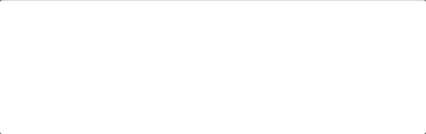
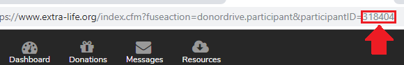

# Last Donation

Displays the name of the last donator and amount they donated to a specified participant or set of participants campaigns.

### Static


### Animated with header


### Animated with header and recipient


### Animation from left



## Settings
To update the settings update their value in `last-donation-settings.js` with any plain text editor. If you make settings changes while the scene is active you can refresh the widget by right clicking the source, selecting "Properties" and then clicking "Refresh cache of current page".

| Name | Description | Value Type | Default value |
|---|---|---|---|
| animate | Animate the last donation instead of persist on screen | Boolean | false |
| animationPauseMS | Duration that the last donation message is displayed in milliseconds. Only used if animate is true | Integer | 5000 |
| animationDirection | Direction of animation. Only used if animate is true | "left" \| "right" | "left" |
| participantIds | Extra Life participant IDs | Array of Text | Empty array |
| unknownDonorName | Donor name to show if the donor name is null | Text | "Mysterious Hero" |
| unknownDonationAmountText | Text to display when donor has elected to only show the amount to the participant | Text | "Private Donation" |
| showHeader | If the header message should be shown | Boolean | false |
| headerMessage | Header message to display at the top of the widget| Text | "Last Donation" |
| showRecipient | Should the recipient of the donation be shown | Boolean | false |
| conjunctionText | Text to use between the donation and the participant name if `showRecipient` is true | Text | "donated to" |
| soundList | List of paths to sound files. If any are set a random one will play on every new donation. It is easiest to have just the file names in the list and to put the audio files in the last-donation directory | Array of Text | Empty array |
| donationCycleMS | How long to display each donation before going to the next. | Integer | 10000 |
| refreshTimeMS | How often the data should be refreshed in milliseconds | Integer | 10000 |
| incentives | List of Incentives to treat differently than normal donations | Object |  |

### How to get someone's Participant ID

1. Go to [extra-life.org](https://www.extra-life.org/)
2. Navigate to the person's participant fundraising page
3. Copy the Participant ID out of the address bar. It is the number after "participantID" and should be at the end of the address. See example image



### How to configure custom messages and sounds for Incentives

1. Enter the Participant ID(s) into the `last-donation-settings.js` file
2. Open the `incentive-config.html` file in your web browser
3. Copy the text from the page and replace the `incentives: {}` line in the `last-donation-settings.js` file with the block displayed
	```
	⚠ Everything from "incentives: {" through the "}" on a line by itself at the bottom
	```
4. Remove incentives you do not want to treat differently from a normal donation (All 4 lines in the following example.)
	```
	"C37CACA4-0CFB-D042-B9A1543222BA4943": {
		"incentiveText": "Widget Test Incentive 1",
		"incentiveSoundList": ["ExampleSound.ogg"]
	},
	```
5. Add sound(s) to the incentives you want sounds for ("ExampleSound.ogg" is a placeholder), and customize the text if desired

Here is an example of an incentive with custom text and a list of sounds to choose from randomly:

```
"C37CACA4-0CFB-D042-B9A1543222BA4943": {
	"incentiveText": "Do a Little Dance!",
	"incentiveSoundList": ["ExampleSound.ogg", "Fanfare.wav", "Towel.mp3"]
},
```

## Setup in OBS or Streamlabs
1. In the "Sources" section click the "+" to add a new source, selecting "BrowserSource"
2. Select the "Create new" radio button
3. Set the name to something appropriate (e.x. "Extra Life Tracker - Last Donation")
4. Make sure "Make source visible" is checked
5. Click "OK" to create the source
6. Check "Local file"
7. Click "Browse" next to the "Local file" line and select `last-donation.html`
8. Set "Width" to at least 300 (the widget will fill the whole width given). 450 if using animation.
9. Set "Height" to 41. 70 if using animation. (+28 with header, +35 with recipient)
10. Click "OK"
11. Finally, if using animation, position the source to the right or left hand side of the screen to coincide with the animation.
