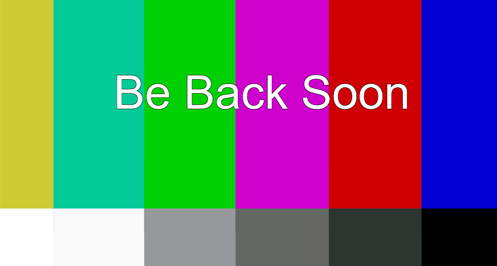

# Offline Screen

A screen to display a message and play music when you are offline or taking a break.

## Settings
To update the settings update their value in `offline-screen-settings.js` with any plain text editor. If you use the setup process below settings changes will be reflected when the scene is next made active.

| Name | Description | Value Type | Default value |
|---|---|---|---|
| message | The message to display | Text | "Be Back Soon" |
| useBackgroundImage | If the provided background image should be used instead of a baground gradiant | Boolean | true |
| backgroundImage | Path to an image to use as a background | Text | "offline-background.png" |
| playMusic | If the provided music file should be played when the offline screen is active | Boolean | true |
| music | Path to music track to play | Text | "bensound-theelevatorbossanova.mp3" |

## Setup in OBS or Streamlabs
These steps will get you set up in OBS with this as a new scene that you can select when you want to go offline and will have the message and music refresh when the scene becomes visable and turn the scene off (muting any music) when the scene is left.

1. In the "Scenes" section click the "+" to add a new scene
2. Set the name of the scene to something appropriate (e.x. "Offline")
3. In the "Sources" section click the "+" to add a new source, selecting "BrowserSource"
4. Select the "Create new" radio button
5. Set the name to something appropriate (e.x. "Extra Life Tracker - Offline Screen")
6. Make sure "Make source visible" is checked
7. Click "OK" to create the source
8. Check "Local file"
9. Click "Browse" next to the "Local file" line and select `offline-screen.html`
10. Set "Width"
    - If not using a background image use the width of your stream source
    - If using a background image use the width of your image (for the default image that is 1920)
11. Set "Height"
    - If not using a background image use the height of your stream source
    - If using a background image use the width of your image (for the default image that is 1080)
12. Check "Shutdown source when not visible"
13. Check "Refresh browser when scene becomes active"
14. Click "OK" to finish the setup
