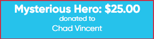
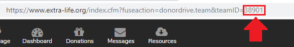

# Team Goal

A widget that displays the name of the last donator, the amount they donated, and the participant they donated to for a specified team.

## Settings
To update the settings update their value in `team-last-donation-settings.js` with any plain text editor. If you make settings changes while the scene is active you can refresh the widget by right clicking the source, selecting "Properties" and then clicking "Refresh cache of current page".

| Name | Description | Value Type | Default value |
|---|---|---|---|
| teamId | Extra Life team ID | Text | N/A |
| conjunctionText | Text to use between donation and participant name | Text | "donated to" |
| donationCycleMS | When more than one donation comes in between checks it will cycle through them. This is how long to pause on each one till it gets to the latest | Integer | 10000 |
| refreshTimeMS | How often the data should be refreshed in milliseconds | Integer | 20000 |

### How to get your Team ID

1. Go to [extra-life.org](https://www.extra-life.org/)
2. Log in to your 
3. Click "Team Page" in the top bar of the page
4. Copy the Team ID out of the address bar. It is the number after "teamID" and should be at the end of the address. See example image

## Setup in OBS
1. In the "Sources" section click the "+" to add a new source, selecting "BrowserSource"
2. Select the "Create new" radio button
3. Set the name to something appropriate (e.x. "Extra Life Tracker - Team Last Donation")
4. Make sure "Make source visible" is checked
5. Click "OK" to create the source
6. Check "Local file"
7. Click "Browse" next to the "Local file" line and select `team-last-donation.html`
8. Set "Width" to at least 300 (the widget will fill the whole width given)
9. Set "Height" to 76
10. Click "OK" to finish the setup
